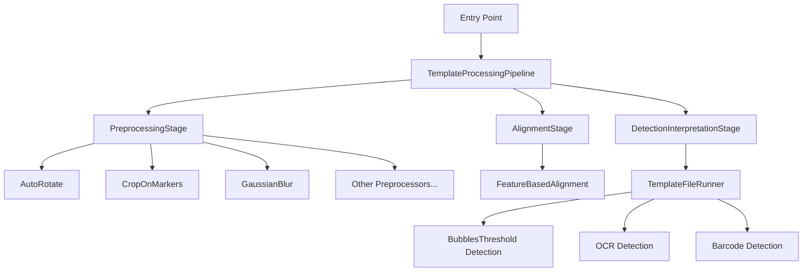

# Pipeline Architecture Documentation

## Overview

The OMRChecker pipeline architecture provides a clean, modular, and testable way to process OMR (Optical Mark Recognition) images. The pipeline pattern separates concerns into distinct stages, making the codebase easier to understand, maintain, and extend.

## Architecture Diagram



## Core Components

### 1. ProcessingContext

A dataclass that flows through all pipeline stages, carrying all necessary data:

```python
@dataclass
class ProcessingContext:
    # Input data
    file_path: Path | str
    gray_image: MatLike
    colored_image: MatLike
    template: Any

    # Processing results (populated by stages)
    omr_response: dict[str, str]
    is_multi_marked: bool
    field_id_to_interpretation: dict[str, Any]

    # Additional metadata
    metadata: dict[str, Any]
```

**Benefits:**
- Single object to pass between stages
- Easy to add new data without changing signatures
- Type-safe with dataclasses
- Clear separation of inputs and outputs

### 2. PipelineStage (Abstract Base Class)

All stages inherit from this base class:

```python
class PipelineStage(ABC):
    @abstractmethod
    def execute(self, context: ProcessingContext) -> ProcessingContext:
        """Execute this stage of the pipeline."""
        pass

    @abstractmethod
    def get_stage_name(self) -> str:
        """Get a human-readable name for this stage."""
        pass
```

**Benefits:**
- Consistent interface for all stages
- Easy to add custom stages
- Testable in isolation
- Clear contract for implementation

### 3. Pipeline Stages

#### PreprocessingStage

**Purpose:** Applies image transformations (rotation, cropping, filtering)

**Responsibilities:**
- Creates a copy of the template layout
- Resizes images to processing dimensions
- Runs all preprocessors in sequence
- Optionally resizes to output dimensions

**Input:** Raw images from file
**Output:** Preprocessed images ready for alignment

#### AlignmentStage

**Purpose:** Applies feature-based alignment if configured

**Responsibilities:**
- Checks if alignment is configured
- Applies template alignment using reference image
- Updates template with alignment transformations

**Input:** Preprocessed images
**Output:** Aligned images ready for detection

#### DetectionInterpretationStage

**Purpose:** Extracts OMR data and interprets results

**Responsibilities:**
- Resizes images to template dimensions
- Normalizes images
- Runs field detection (bubbles, OCR, barcodes)
- Interprets detected data
- Extracts metrics and flags

**Input:** Aligned images
**Output:** OMR responses and interpretation metrics

### 4. TemplateProcessingPipeline

The main orchestrator that chains all stages together:

```python
class TemplateProcessingPipeline:
    def __init__(self, template):
        self.stages = [
            PreprocessingStage(template),
            AlignmentStage(template),
            DetectionInterpretationStage(template),
        ]

    def process_file(self, file_path, gray_image, colored_image) -> ProcessingContext:
        """Process a file through all stages."""
        context = ProcessingContext(file_path, gray_image, colored_image, template)
        for stage in self.stages:
            context = stage.execute(context)
        return context
```

**Benefits:**
- Simple API for external consumers
- Easy to add/remove stages dynamically
- Consistent error handling
- Clear execution flow

## Usage

### Basic Usage (New Way)

```python
from src.algorithm.template.template import Template
from src.utils.image import ImageUtils

# Load template and image
template = Template(template_path, tuning_config)
gray_image, colored_image = ImageUtils.read_image_util(file_path, tuning_config)

# Process through the entire pipeline
context = template.process_file(file_path, gray_image, colored_image)

# Access results
omr_response = context.omr_response
is_multi_marked = context.is_multi_marked
field_interpretations = context.field_id_to_interpretation
```

### Legacy Usage (Old Way - Still Supported)

```python
# This still works for backward compatibility
gray_image, colored_image, template = template.apply_preprocessors(...)
gray_image, colored_image, template = apply_template_alignment(...)
omr_response, raw_response = template.read_omr_response(...)
is_multi_marked, fields = template.get_omr_metrics_for_file(...)
```

### Custom Stages

You can add custom stages to the pipeline:

```python
class CustomStage(PipelineStage):
    def get_stage_name(self) -> str:
        return "Custom Processing"

    def execute(self, context: ProcessingContext) -> ProcessingContext:
        # Your custom logic here
        context.metadata["custom_data"] = "processed"
        return context

# Add to pipeline
template.pipeline.add_stage(CustomStage())
```

## Migration Guide

### For Code Using `entry.py`

**Before:**
```python
# Multiple separate calls
gray_image, colored_image, template = template.apply_preprocessors(...)
if gray_image and "gray_alignment_image" in template.alignment:
    gray_image, colored_image, template = apply_template_alignment(...)
omr_response, raw_response = template.read_omr_response(...)
is_multi_marked, fields = template.get_omr_metrics_for_file(...)
```

**After:**
```python
# Single unified call
context = template.process_file(file_path, gray_image, colored_image)
omr_response = context.omr_response
is_multi_marked = context.is_multi_marked
fields = context.field_id_to_interpretation
```

### For Custom Processors

Preprocessors remain unchanged - they still implement `ImageTemplatePreprocessor` and work exactly as before. The pipeline calls them through the `PreprocessingStage`.

## Benefits of the New Architecture

### 1. Clearer Separation of Concerns
- Each stage has a well-defined purpose
- Preprocessing vs Detection vs Interpretation are explicit
- No confusion about when each operation happens

### 2. Better Testability
- Each stage can be tested independently
- Mock one stage while testing another
- Easy to write integration tests for the full pipeline

### 3. Improved Extensibility
- Add new stages without modifying existing code
- Remove or reorder stages dynamically
- Custom stages for specific use cases

### 4. Simplified Entry Point
- `entry.py` is much cleaner and easier to understand
- Single method call instead of multiple coordinated calls
- Less error-prone

### 5. Type Safety
- `ProcessingContext` provides type hints
- Linters can catch errors at development time
- Better IDE support and autocomplete

### 6. Consistent Error Handling
- Pipeline catches and logs errors consistently
- Easy to add retry logic or fallbacks
- Better debugging information

### 7. Better Observability
- Each stage logs its execution
- Easy to measure performance per stage
- Clear understanding of where time is spent

## Performance Considerations

The pipeline adds minimal overhead:
- Context creation: O(1)
- Stage iteration: O(n) where n is number of stages (typically 3)
- No additional image copying beyond what was already happening

The benefits far outweigh the negligible performance cost.

## Future Enhancements

Possible future improvements:
1. **Parallel Stage Execution**: Run independent stages in parallel
2. **Stage Caching**: Cache results of expensive stages
3. **Conditional Stages**: Skip stages based on template configuration
4. **Stage Metrics**: Detailed performance metrics per stage
5. **Pipeline Visualization**: Generate diagrams of actual pipeline execution

## Testing

Comprehensive tests are provided in `src/tests/test_pipeline.py`:

```bash
# Run pipeline tests
pytest src/tests/test_pipeline.py -v

# Run with coverage
pytest src/tests/test_pipeline.py --cov=src/algorithm/pipeline
```

## Troubleshooting

### Issue: Pipeline not found
**Solution:** Make sure you've imported from the correct location:
```python
from src.algorithm.pipeline import TemplateProcessingPipeline
```

### Issue: Old code breaks after migration
**Solution:** The legacy methods are still supported. You can migrate gradually:
1. Keep using `apply_preprocessors()`, `read_omr_response()` etc.
2. New code should use `template.process_file()`
3. Migrate old code incrementally

### Issue: Need to access intermediate results
**Solution:** Access the context at any point:
```python
# Run only preprocessing
pipeline = TemplateProcessingPipeline(template)
context = pipeline.stages[0].execute(context)  # Preprocessing only
```

## Related Documentation

- [Architecture Overview](architecture-before-after.md)
- [Preprocessors Guide](../v2/About-Templates.md)
- [Detection & Interpretation](architecture-analysis-detection-interpretation.md)

## Credits

This pipeline architecture was designed to address the complexity issues identified in the original codebase refactoring. It provides a clean separation between image preprocessing (Preprocessors) and data extraction (TemplateFileRunner) while making the overall flow more maintainable and testable.

